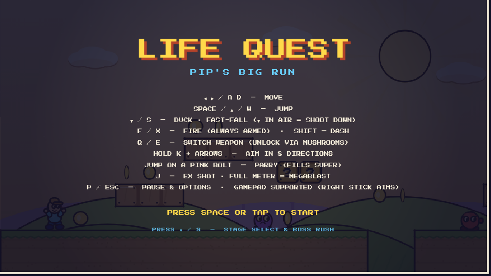
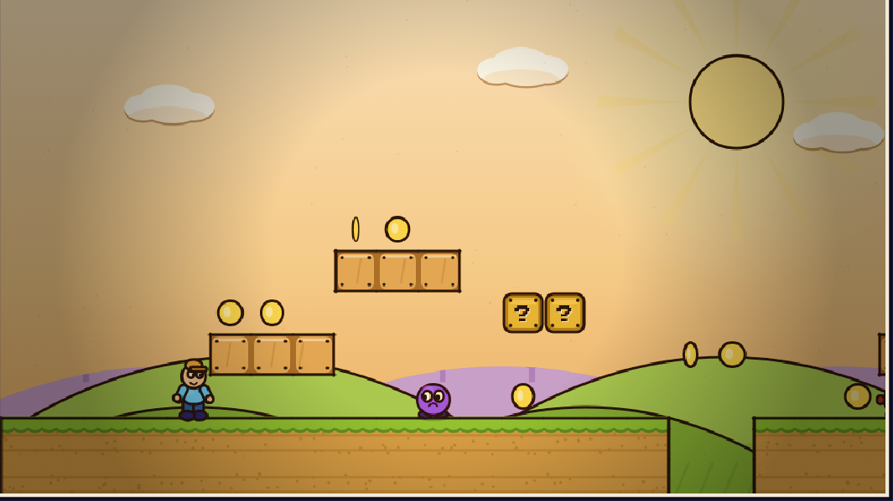
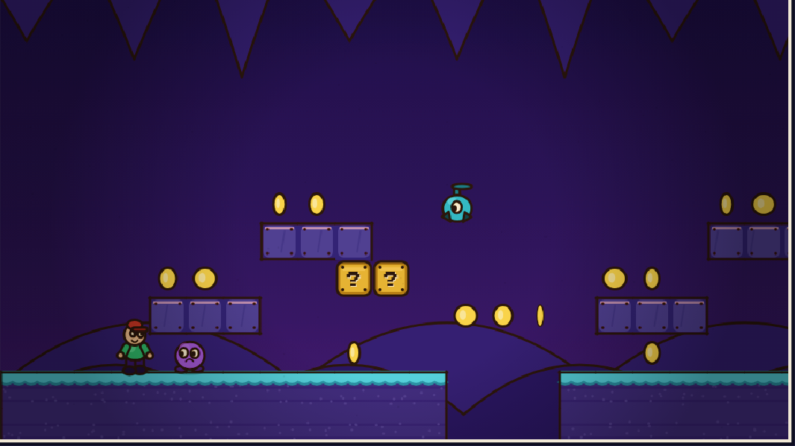
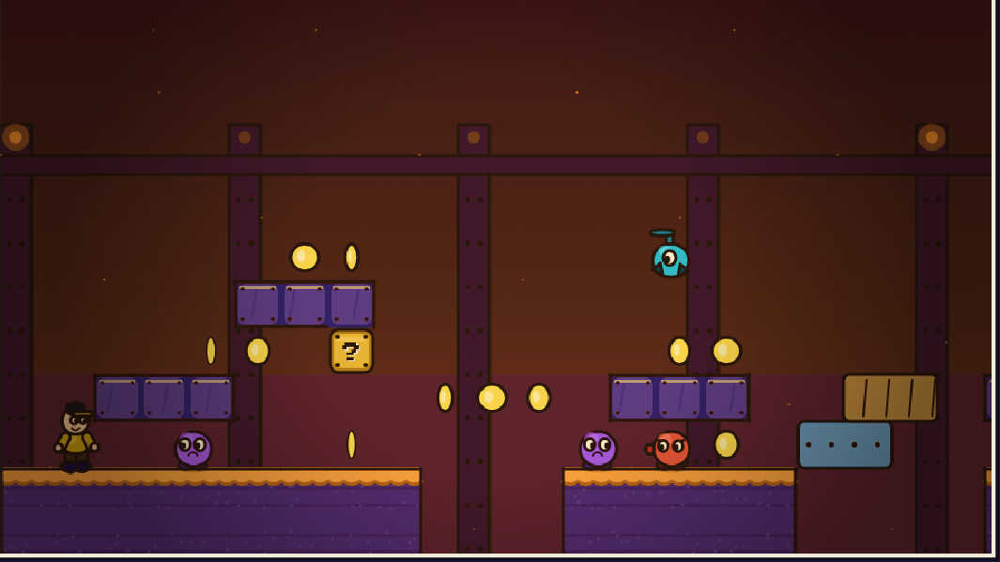
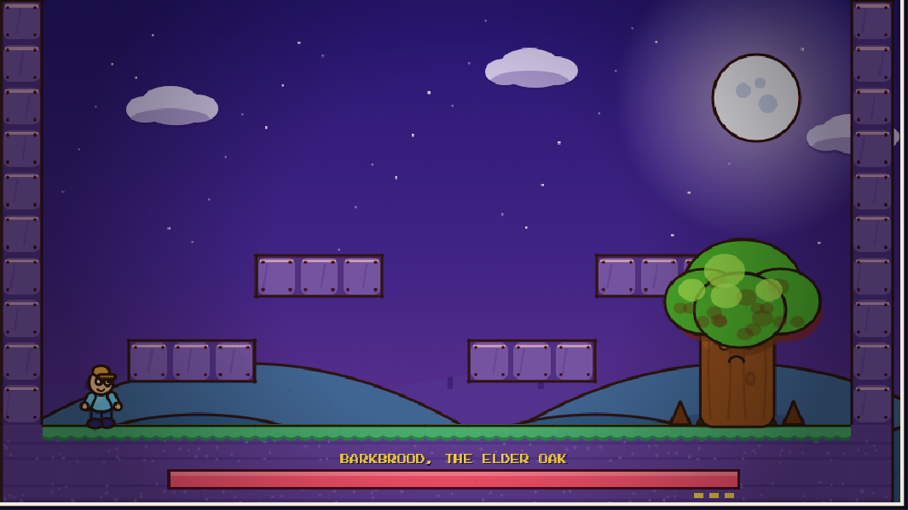

# Life Quest — Pip's Big Run

A 2D side-scrolling platformer that runs entirely in the browser on a single
`<canvas>` — **no engine, no image assets, no backend.** Run right across
tile-based levels, collect coins, stomp foes, dodge hazards, parry pink bolts,
and topple four hand-drawn bosses — solo, or **online with a friend**.

Its signature is a **1930s rubber-hose ("Cuphead") art style**, rendered live
with ink-outlined curves, boiling lines, and a warm vintage film grade — all
hand-drawn on the Canvas 2D API at runtime. A clean **"mario" pixel style** ships
alongside it and can be toggled any time.

> **Stack:** Vite · TypeScript (strict) · Canvas 2D · Web Audio (synthesized SFX + music). No frameworks.

<p align="center">
  
</p>

## Four hand-drawn biomes

Every level is its own place. The Cuphead renderer ships a distinct palette and
parallax backdrop per theme — atmospheric depth layers, textured turf, and a
boiling-ink outline on everything that moves.

| Meadow (day) | Cavern |
| --- | --- |
|  |  |
| Golden-hour sky, haloed sun with rotating rays, rolling green hills. | Purple gloom, a stalactite ceiling, and glowing teal crystal clusters. |

| Foundry | Boss arena (night) |
| --- | --- |
|  |  |
| Smoky amber haze, riveted girder columns, hazard lamps, rising embers. | Moonlit hills, a cratered moon, and **BARKBROOD, the Elder Oak**. |

## Features

- **2-player online co-op** — share one world with a friend over a 4-letter code.
  No server, no sign-up; the connection is peer-to-peer (WebRTC). See below.
- **Two switchable art styles** — rubber-hose *Cuphead* (vintage ink + film grade)
  or clean *Mario* pixel art. Toggle in the pause menu or via `?style=cuphead`.
- **Per-biome look** — day meadow, moonlit night, crystal cavern, industrial
  foundry; each with its own sky, backdrop, and tile palette.
- **Four bosses** with multi-phase patterns — BARKBROOD (oak), GRANITE (stone
  golem), RIME (ice spire), and **THE OVERCLOCK** (airborne finale) — plus three
  mechanic-showcase levels (ferries, dash-gaps, parry-traversal).
- **Real platforming kit** — running, variable jump, duck/fast-fall, dash,
  wall-jump, shooting, a **parry** on pink bolts, moving + crumbling platforms,
  checkpoints.
- **Accessibility & options** — three difficulty tiers, master volume,
  reduced-motion (freezes the boil/grain/shake), a **colorblind-friendly UI
  palette**, and on-screen touch controls.
- **Synthesized audio** — every SFX and music track is generated at runtime with
  the Web Audio API; there are no audio files in the repo.
- **Levels are data** — each level/boss is a JSON file; no code changes to add one.

## 2-player online co-op

Play the whole campaign together in **one shared world** — same enemies, same
bosses, same chasms.

1. Press **`C`** on the title screen to open the co-op lobby.
2. One player picks **Host** and reads out the **4-letter code**; the other picks
   **Join** and types it in.
3. You're connected — both players drop into the level and play together.

How it works and what's shared:

- **Shared world, host-authoritative.** The host runs the one simulation; both
  players fight the *same* enemies and the *same* boss (combined damage), and
  clearing the flag advances both.
- **Per-player lives.** Each player has their own HP and lives (shown as a P1/P2
  card in the HUD). A fallen player spends one of their own lives and respawns
  beside their partner, or sits out as a spectator until the next stage; the run
  only ends when both are down.
- **Responsive controls.** The joining player's character is predicted locally, so
  movement feels instant rather than waiting on the network.
- **Peer-to-peer, no backend.** Transport is WebRTC via [PeerJS]; its public broker
  is used only for the initial handshake (signaling). Once connected, all game
  data flows directly between the two players — there is no game server, and no
  account is required. Best on a decent connection between the two peers.

Single-player is unchanged and remains the default — co-op is entirely opt-in.

[PeerJS]: https://peerjs.com/

## Run it

```bash
npm install
npm run dev      # dev server with hot reload  →  http://localhost:5173
npm run build    # type-check (tsc) + production build to dist/
npm run preview  # serve the production build   →  http://localhost:4173
npm test         # vitest unit tests
```

Open the dev URL and press **Space** to start. Append `?style=cuphead` or
`?style=mario` to force an art style (it's remembered afterward).

## Controls

| Action | Keys |
| --- | --- |
| Move | `← →` / `A D` |
| Jump | `Space` / `↑` / `W` |
| Duck (ground) / Fast-fall (air) | `↓` / `S` |
| Shoot | `F` / `X` |
| Dash | `Shift` |
| Switch weapon | `Q` / `E` (unlocked via mushrooms) |
| Aim shot (8-way) | hold `K` + arrows |
| EX shot / **MEGABLAST** | `J` (when meter is full) |
| Pause & options | `P` / `Esc` |
| **2-player online co-op** | `C` (from the title screen) |

Gamepad is supported (right stick aims). On non-play screens, `Space/Enter`
advances; `↓`/`S` opens **Stage Select**; `C` opens **co-op**. Touch
buttons appear on mobile.

## Project structure

```
src/
  main.ts              bootstrap, scaling, fixed-step update orchestration
  types.ts             shared interfaces (Level, Player, Enemy, Boss, Style, …)
  game/                constants, state, level builder, physics, player, enemy,
                       coin, flow, boss, settings, difficulty, grade, select,
                       coop (online shared-world glue)
  engine/              loop (fixed timestep), input, audio (synth), camera,
                       net (WebRTC transport) + lobby (host/join overlay)
  render/
    render.ts          top-level draw(): bg → tiles → entities → player → hud
    background.ts      style dispatch + the mario parallax backdrops
    themes.ts          per-biome ThemeVisual (mario palette)
    overlays.ts        pause menu, vintage grade, boss cards, stage select, HUD
    ink.ts             rubber-hose ink toolkit (curves, boil, hose limbs, eyes)
    style-ctx.ts       per-frame art-style flag (cuphead vs mario)
    sprites/           mario pixel sprites + dispatch
      cuphead/         the rubber-hose art path:
        theme.ts         per-biome ink palettes (sky, hills, ground, accent)
        background.ts    sky + sun/moon + hills / cavern / foundry backdrops
        tiles.ts         scalloped turf, dirt strata, carved stone, prize crates
        player.ts        Pip, enemies.ts, fx.ts, boss.ts (all ink + boil)
  levels/              level1–6 (meadow · cavern · foundry · tidal · ember ·
                       glitch) + boss1–4  — all authored JSON
```

### Design rules (see [`CLAUDE.md`](./CLAUDE.md))

- **Levels are data, not code** — add `src/levels/levelN.json`, register it in
  `game/levels.ts`, add a skin + music track. No physics changes.
- **All gameplay constants live in `game/constants.ts`** — no magic numbers.
- **The render layer never mutates state** — `update()` mutates, `draw()` reads.
- **Fixed timestep** — physics is decoupled from the frame rate.
- **The Cuphead path is additive** — each sprite module checks the style flag and
  delegates to its rubber-hose variant, so the pixel path stays untouched.

## License

Personal project — all rights reserved unless a license file says otherwise.
